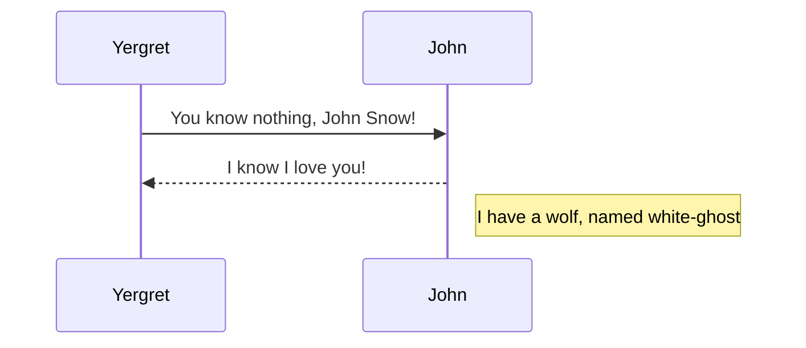
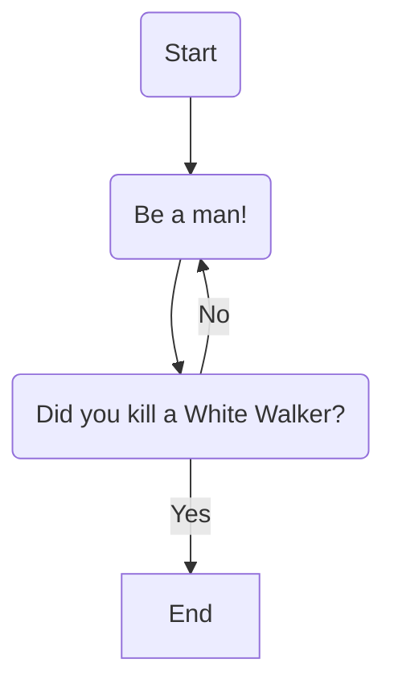
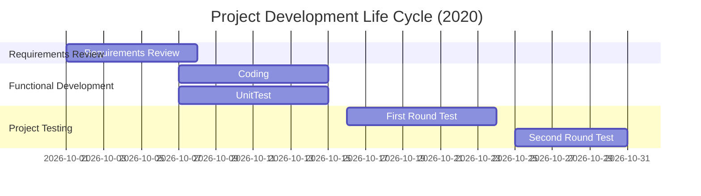

# Diagram #

## Sequence Diagram ##

```sequence
Yergret->John: You know nothing, John Snow!
Note right of John: I have a wolf, named white-ghost
John-->Yergret: I know I love you!
```

## Flow chart ##

```flow
st=>start: Begin
op=>operation: Be a man!
cond=>condition: Did you kill a White Walker?
e=>end: End

st->op->cond
cond(yes)->e
cond(no)->op
```

```mermaid
	graph TB
	A[Apple]-->B{Boy}
	A---C(Cat)
	B.->D((Dog))
	C==喵==>D
	style A fill:#2ff,fill-opacity:0.1,stroke:#faa,stroke-width:4px
	style D stroke:#000,stroke-width:8px;

```

## Mermaid ##

**1 Sequence Diagram**


**2 Flow Chart**



**3 Gantt Chart**

